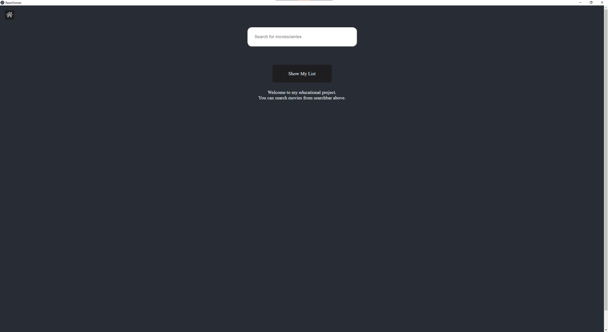
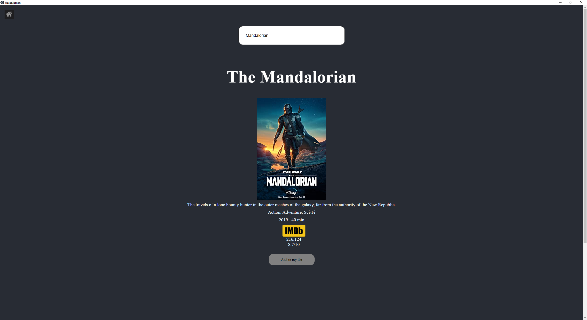

Bu proje React ve Electron kullanmaktadır.Type Script ile yazılmış eğitimsel bir projedir. 
http://www.omdbapi.com/ API’sini kullanarak imdb’de bulunan dizi ve filmleri aramanızı sağlar. Aradığınız bu dizi ve filmlere tıklayarak onlar hakkında daha detaylı bilgi alabilirsiniz. Eğer beğendiniz dizi ve filmleri listenize eklemek istiyorsanız dizi sayfasında bulunan “Add to my list” butonuna basabilirsiniz. Listenize eklediğiniz diziler localstorageda depolanır. Eğer listenizi görmek istiyorsanız başlangıç sayfasında bulunan “Show my list” butonunu kullanabilirsiniz.

